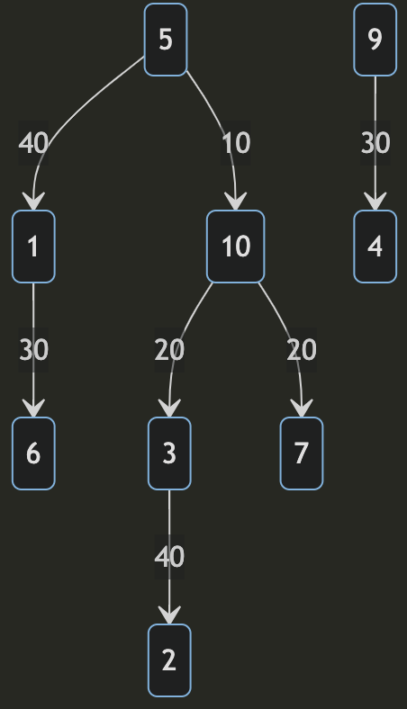

# Evolution Monstersの解説

## 考察ステップ1

それぞれのモンスターを頂点とし，それぞれの進化を頂点を結ぶ有向辺（進化元から進化先の向き）で表し，進化石の値段を対応する進化の辺の重みとして表すと，問題の情報を **重み付き有向グラフ** として表すことができることがわかります．

さらに，問題文中の進化の説明から，与えられるグラフは必ず **森** であることがわかります．

よって，この問題は次のように言い換えられます．

$M$辺$N$頂点の **重み付き有向根付き森** が与えられたあとに，クエリが$Q$個与えられます．各クエリでは，2つの頂点$P_1$，$P_2$が与えられます．それぞれのクエリについて，$P_2$が$P_1$の子孫でない場合は `IMPOSSIBLE` ，$P_2$が$P_1$の子孫である場合は，$P_1$から$P_2$へのパスにおいて$P_1$の次に通る頂点，および，そのパスの長さを出力しなさい．

## 考察ステップ2

したがって，解く問題は，以下の3つです．

1. 子孫判定（LCA）
2. 与えられた頂点間パス上の累積和
3. 与えられた頂点間のパス上で，始点の次に通る点

3.は少し難しいですが，1.と2.から， **Euler Tour** によって解く問題であることが推測できます．また， **Euler Tour** を頭においた状態で3.を考えると，実は3.も， **Euler Tour** に一手間加えるだけで解くことができることに気づきます．

## 考察ステップ3

入力例2を考えてみます．

```
10 7 6
20 10 3
40 5 1
30 9 4
20 10 7
30 1 6
10 5 10
40 3 2
8 10
3 4
10 6
5 7
10 2
5 9

```

入力例2では，10個の頂点と，7個の辺を持つ森に対して，6個のクエリが与えられます．

<div align="center"></div>

便宜上，モンスター$5$を根とする木を木$1$，モンスター$9$を根とする木を木$2$と呼びます．木$1$と木$2$はそれぞれ独立して考えることができるので，まず木$1$について考えます．

木1において，根ノード（頂点$5$）からDFSをし，通過した頂点と，辺の重みを順番に記録します．（ **Euler Tour** ）ただし，有向辺の逆向きに辿った辺はマイナスの値として記録することにします．すると，以下のような配列が生成できます．

|通った時刻|0|1|2|3|4|5|6|7|8|9|10|11|12|
|:-:|:-:|:-:|:-:|:-:|:-:|:-:|:-:|:-:|:-:|:-:|:-:|:-:|:-:|
|**通った頂点**|5|1|6|1|5|10|3|2|3|10|7|10|5|
|**通った辺の重み**|-|40|30|-30|-40|10|20|40|-40|-20|20|-20|-10|
|**辺の重みの累積和**|0|40|70|40|0|10|30|70|30|10|30|10|0|

## 考察ステップ4

ここで，入力例2のクエリの1つである，$P_1=5, P_2=7$について考えてみましょう．

上の配列において，頂点$5$を通ったのは時刻$0,4,12$であり，頂点$7$を通ったのは時刻$10$です．ここから，$0 < 10 < 12$であるため，頂点$7$は頂点$5$の子孫であることがわかります．（あらかじめ，それぞれの頂点ごとに通った時刻を記録しておくことで，これは$O(1)$で求まります．）

頂点$7$が頂点$5$の子孫であることが確認できたので，次に，頂点$5$，頂点$7$間のパス上の辺の重みの合計を求めます．頂点$7$を通った時刻$10$は，頂点$5$を通ったのは時刻$0,4,12$における時刻$4$と時刻$12$の間にあります．ここから，頂点$5$，頂点$7$間のパス上の辺の重みの合計は，上の配列の，辺の重みの累積和の時刻$10$の値$30$から，時刻$4$の値$0$を引いた$30$ということになります．また，頂点$5$の次に通る頂点は，頂点$5$を通った時刻が$4$であることから，頂点$5$，頂点$7$間のパスにおいて，頂点$5$の次に通る頂点は，明らかに時刻$4+1$にであるため，頂点$10$ということになります．（頂点$P_1$を通った時刻の配列から頂点$P_2$を最初に通った時刻を2分探索することで，$O(\log N)$で求まります．）

DFSをする際にそれぞれの頂点がどの木に属するかを一緒に記録しておくことで，木$2$についても同様の情報を持つことで木ごとに問題を解くことができます．頂点$P_1$と頂点$P_2$が違う木に存在する頂点の時，答えは明らかに `IMPOSSIBLE` です．

以上から，DFSに$O(N)$，辺の重みの累積和を求めるのに$O(N)$，$Q$個のクエリごとに$O(\log N)$かかります．よって，全体の計算量は$O(N + Q \log N)$となり，これは実行時間制限に対して十分高速です．